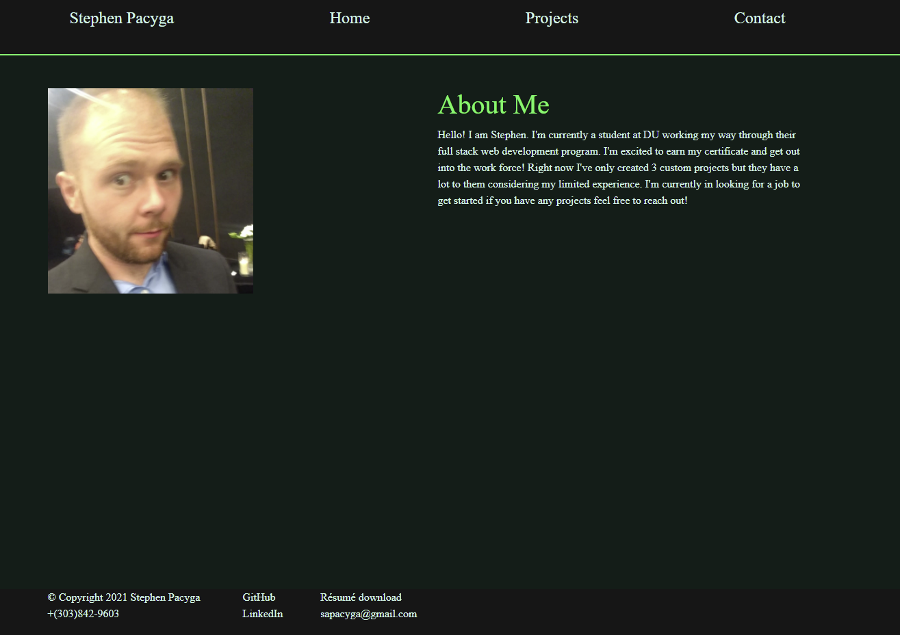

# portfolio

## Description:

It's my current portfolio. 

## Image

## Table of Contents

[Description](#Description) 
[Function](#Function) 
[Inspiration](#Inspiration) 
[Installation](#Installation) 
[Usage](#Usage) 
[Contributing](#Contributing) 
[Tests](#Tests) 
[Questions](#Questions) 

## Function:

It introduces me and shows some examples of my work.  

## Inspiration:

To demonstrate my current knowledge of web development and practice with react.js 

## Installation:

npm i  

## Usage:

It's a good example of a portfolio. 

## Contributing:

I'm open to branches

## Tests:

N.A.

## Questions:

[github.com/AlbertTundy](http://github.com/AlbertTundy) 

### email me at:

sapacyga@gmail.com
